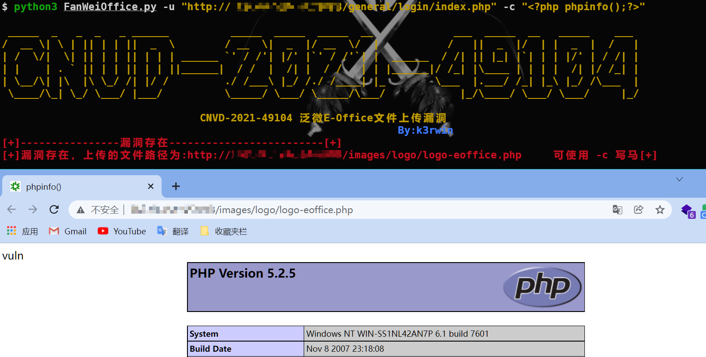

# 泛微E-Office文件上传漏洞CNVD-2021-49104 文件上传

## 1.installation

```shell
pip3 install -r requirements.txt
```

## 2.Usage

```shell
$ python3 FanWeiOffice.py -h

 _____  _   _  _   _ ______          _____  _____  _____  __             ___  _____  __   _____    ___
/  __ \| \ | || | | ||  _  \        / __  \|  _  |/ __  \/  |           /   ||  _  |/  | |  _  |  /   |
| /  \/|  \| || | | || | | | ______ `' / /'| |/' |`' / /'`| |  ______  / /| || |_| |`| | | |/' | / /| |
| |    | . ` || | | || | | ||______|  / /  |  /| |  / /   | | |______|/ /_| |\____ | | | |  /| |/ /_| |
| \__/\| |\  |\ \_/ /| |/ /         ./ /___\ |_/ /./ /____| |_        \___  |.___/ /_| |_\ |_/ /\___  |
 \____/\_| \_/ \___/ |___/          \_____/ \___/ \_____/\___/            |_/\____/ \___/ \___/     |_/

                                CNVD-2021-49104 泛微E-Office文件上传漏洞
                                                                By:k3rwin
usage: FanWeiOffice.py [-h] [-u U] [-r R] [-c C]

命令行传入url参数，-u 指定单个地址，-r 指定批量地址，-c 写马

optional arguments:
  -h, --help  show this help message and exit
  -u U        单个url地址
  -r R        url文件列表
  -c C        写马，参数为木马内容
```

## 3.example




